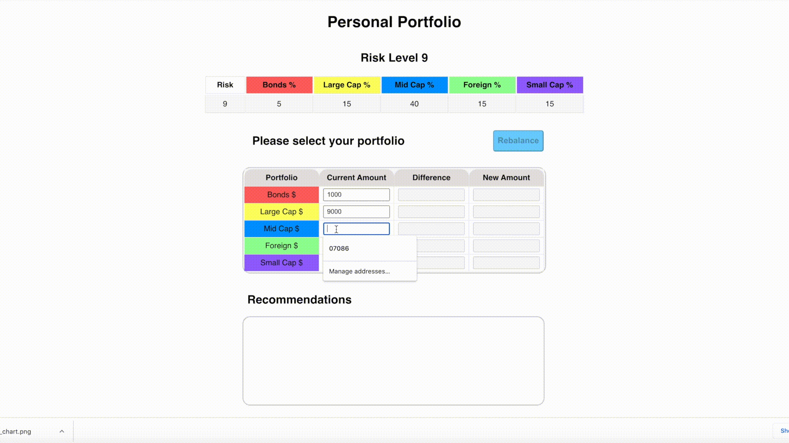

## Setup:
  1. npm install
  2. npm start
  3. webSite: https://maggieyam.github.io/financial_advisor
  4. video link: https://youtu.be/Q7PY_at3k6c

## Components:
* Navbar
  1. Navbar is fixed on both pages.
  2. Clicking the Home button will navigate user to the home page.

* Risk Preference:
  1. The app contains ten differen risk levels, each risk level contains a portfolio with 5 assets.
  2. Users can choose one risk level and click continue button to the portfolio page.
  3. After user selected a risk, the pie chart will show corresponding holdings.
  4. I Hardcoded risk preferences data which stores in preference_util.js.
  5. I can also use a mock server, which will read files from db.json. Since the file format is not efficient, I decided to request data from hardcoded.
  6. Each color represents an asset -- in header and in the donut chart.
  7. I split risk preference page into a few components:
        * Navbar
        * Preference
        * Table
        * Chart
        

* Portfolio:
  1. Users first input their current asset holdings.
  2. User will see the difference amount for each asset, suggested holdings and recommendations.
  3. If input is not numerical, an alert will be shown, and the Rebalance button will not be enabled.
  3. I put all my calculation related functions under calculator_util.js
  4. I split portfolio page into a few components:
        * Navbar
        * Preference table
        * Portfolio form
        * Portfolio table
  5. Portfolio action file is empty, I kept it there to show what I would usually do.
  
  
  
  
  
* Calculation:
    1. To optimize the transaction, I partition my assets into 2 piles: 
        * cash outflow
        * cash inflow
    2. With the assumption with 5 assets in our portfolio, we can run into senarios:
        * partition: 1 and 4 => In this case, we can quickly conclude that there's only one way for transactions.
        * partition: 2 and 3 => In this case, we need to find if there's a value that can cancel each other by one step.
                                 By doing so, we can save one transaction for our clients.
        * partition: 0 and 5 => An error has occured.
    3. This approach only works if we have 5 assets. For more than 5, I need to find a way to generalize how to minmize the transaction.

* Assumuptions:
    * There are only 10 risk levels.
    * There are only 5 assets in each portfolio.
    * User do not need to save their portfolio in our database.
    * We do not require authentification.
    * I put the pie chart below the table, assuming people do not mind scolling.
      This way is easier for small screens (like iphone) to see the table easily.
    

    

  
